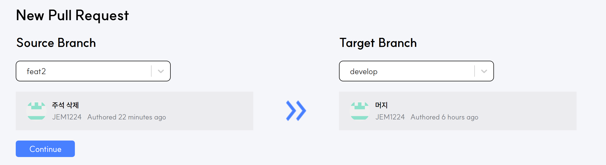
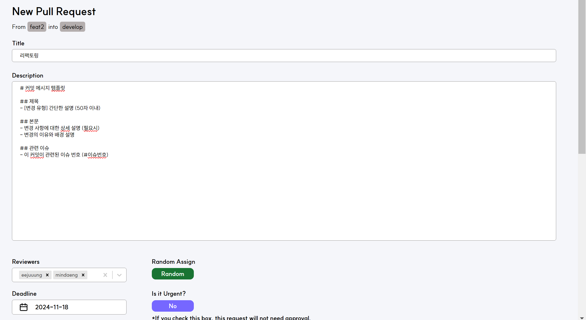
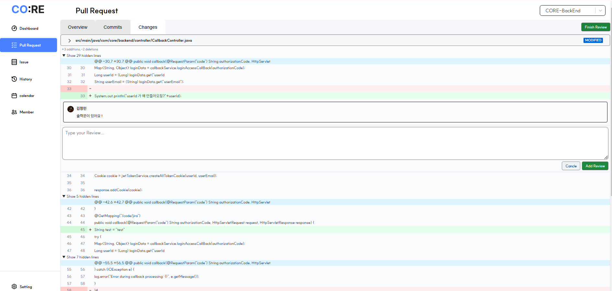
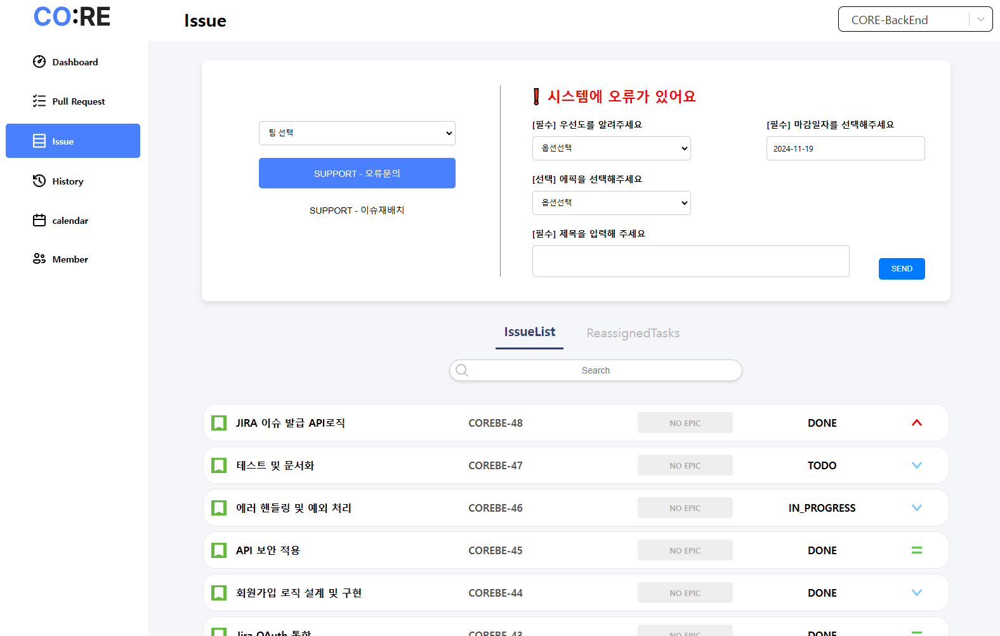
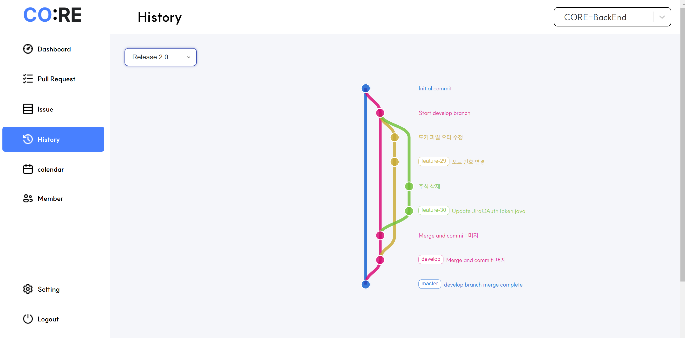
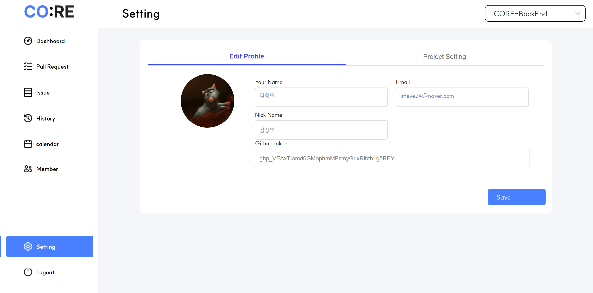

# 💙 코리(CO:RE) 💙

> 삼성 청년 소프트웨어 아카데미 11기 자율 프로젝트  
> 삼성 SDI 기업 연계 프로젝트  
> Jira API를 활용한 프로젝트 관리

## 📚 목차

- [🗓️ 프로젝트 개요](#️-프로젝트-개요)
  - [진행 기간](#진행-기간)
  - [팀 구성](#팀-구성)
- [📢 서비스 소개](#-서비스-소개)
- [🥳 서비스 설계](#-서비스-설계)
  - [기술 스택](#기술-스택)
  - [ERD](#erd)
  - [Wireframe](#wireframe)
  - [Architecture](#architecture)
  - [Docs](#docs)
- [🤗 기능 소개](#-기능-소개)
- [😆 느낀점](#-느낀점)

## 🗓️ 프로젝트 개요

### 진행 기간

- 2024.10.24 ~ 2024.11.19 (6주)

### 팀 구성

[📎 Team Notion](https://ineedalotofmoney.notion.site/SDI-11db8335ace6801dad00d1ecc27f3f4b?pvs=4)
| 강동형 | 고충원 | 지민경 | 김정민 | 이지영 | 김민주 |
| :--------------------------------------------------------------: | :--------------------------------------------------------------: | :--------------------------------------------------------------: | :--------------------------------------------------------------: | :-------------------------------------------------------------: | :-------------------------------------------------------------: |
|  |  |  |  |  |  |
| FE | FE | FE | BE | BE | PM, BE, CI/CD |

## 📢 서비스 소개

적극적인 코드 리뷰 문화를 활성화하여 소프트웨어 개발 과정의 효율을 향상하기 위한 프로젝트 입니다.  
코리는 버전 별 통계, 메일링, 지라 이슈 자동 배정 및 재배치를 통해 팀원 간 협업을 원활히 하고 생산성과 코드 품질을 동시에 높이고자 하였습니다..

  
[📎 서비스 소개 UCC](https://youtu.be/1RaLnhX0iDk)

## 🥳 서비스 설계

### 기술 스택

|               | Frontend                                | Backend                                                |
| ------------- | --------------------------------------- | ------------------------------------------------------ |
| **Language**  | TypeScript                              | Java17                                                 |
| **IDE**       | Visual Studio Code                      | IntelliJ                                               |
| **Framework** | React, Vite                             | Spring Boot, Spring Security, Spring JPA, Spring Cloud |
| **Library**   | zustand, styled-components, React-query |                                                        |

| DB           |                     Infra                      |              Tools               |
| :----------- | :--------------------------------------------: | :------------------------------: |
| MySQL, Redis | AWS EC2, AWS LightSail, Docker, Jenkins, nginx | GitLab, Jira, Notion, Mattermost |

### ERD

[📎 ERD](https://www.erdcloud.com/d/aHjCRhFZ8NccGZaJA)

### Wireframe

[📎 Figma Link](https://www.figma.com/design/lpn5wan6lxWHXhsDLMy0c3/Project?node-id=1-2&t=sUOfVKpMumma8e8d-1)

### Architecture

### Docs

[📎 API](https://ineedalotofmoney.notion.site/API-11db8335ace68122bc35fa791e2dd9eb?pvs=4)  
[📎 기능 정의서](https://ineedalotofmoney.notion.site/4a578c5e0fed44d2ab5beb99c315974d?pvs=4)

## 🤗 기능 소개
> Jira 프로젝트별 권한 미설정시 기능 제한이 있을 수 있습니다. (포팅 메뉴얼 참고)
<!-- TODO: 기능 소개 작성 -->
#### 로그인 & 프로젝트 연걸 

  
  

- 지라 계정과 깃허브 리포지토리를 연결합니다. 
#### PR 리스트 
  

- 자신이 올린 PR리스트와 리뷰어로 할당된 PR 리스트를 볼 수 있습니다.
- 마감 날짜와 우선순위 , 리뷰어 점수에 따른 PR 상태여부를 볼 수 있습니다. 
- 리뷰어가 모두 리뷰를 작성했지만 목표 점수에 도달 못하지 못하면 PR 상태는 rejected가 됩니다.

#### PR 상세보기 
  

- PR 정보를 볼 수 있으며 커밋정보와 변경된 파일 정보를 볼 수 있습니다. 

#### PR 생성

  
  

- PR생성 시 현재 remote 서버 기준으로 존재하는 브랜치들과 마지막 커밋 정보를 확인할 수 있습니다.
- PR작성 시 저장된 템플릿을 바탕으로 커밋리스트를 분석해 PR내용을 작성해줍니다.
- 선택된 브랜치와 비교해서 커밋정보와 변경된 파일 정보를 확인할 수 있습니다. 

#### PR 리뷰

  
  

- 코드에 대한 리뷰와 점수를 등록할 수 있습니다. 
- 작성된 코드에 대해 자세한 코드리뷰를 작성할 수 있습니다. 

#### JIRA 이슈
  

- 오류문의를 남기면 같은 그룹내 타프로젝트 팀원 중 이슈항목이 적은 팀원에게 이슈가 자동으로 할당됩니다.

#### JIRA 이슈 재배치
  

- 이슈 재배치를 요청할 수 있습니다.
- ReassignedTaskes 에서 재배치 요청된 이슈를 볼 수 있습니다.
- 요청된 이슈를 수락 후 본인의 리스트에서 확인 가능합니다. 

#### 대시보드

  
  

- 현재 프로젝트의 통계 정보를 볼 수 있습니다.
- 배포된 버전별 통계 정보를 볼 수 있습니다. 
- 현재 리뷰어 할당을 받거나 이슈 할당을 받은 정보를 볼 수 있습니다. 
- 버전 노트를 통해 버전별 정보를 볼 수 있습니다.

#### 히스토리
  

- 버전별 git flow을 확인할 수 있습니다.

#### 캘린더
  

- 자신이 올린 PR과 리뷰어로 할당된 PR의 마감날짜를 한 눈에 확인할 수 있습니다.

#### 환경설정

  
  

- 프로필과 깃토큰을 등록할 수 있습니다.
- PR 목표 리뷰 점수와 자동 리뷰어 수를 지정할 수 있습니다.
- PR에 적용할 템플릿을 지정할 수 있습니다.

## 😆 느낀점

<table>
  <tr>
    <th rowspan="3">Front</th>
    <td>강동형</td>
    <td>
    <!-- TODO: 강동형 느낀점 -->
    지금까지 프로젝트를 한 경험들이 많은 도움이 됐다고 느꼈습니다. 개발 속도도 많이 올라왔고, 개발 알고리즘이나 다른 부분에서도 막히지 않고 코딩을 진행한 것 같아서 뿌듯했습니다. 이번에는 코드의 가독성과 컴포넌트의 재사용성에 염두를 두고 컴포넌트를 제작했습니다. styled-component를 사용하며 props 와 type 값 지정 개념에 대해 많은 지식을 얻을 수 있었습니다. react-query를 사용하며 mutation, query 기능들도 사용하며 query의 기능에 대해 알 수 있었습니다.
    </td>
  </tr>
  <tr>
    <td>고충원</td>
    <td>
    <!-- TODO: 고충원 느낀점 -->
    이번 프로젝트에서 React, TypeScript, React Query를 활용하면서 프론트엔드 개발에 있어 많은 성장과 깨달음을 얻을 수 있었습니다. 
TypeScript를 React와 함께 사용하면서 컴포넌트 간 데이터 흐름이 더 명확해졌습니다. 타입 정의를 통해 코드 작성 단계에서 잠재적인 버그를 사전에 방지할 수 있었고, 팀원들과의 협업 시 코드의 가독성과 유지보수성이 크게 향상되었습니다. 또한, 타입 시스템 덕분에 개발 도중 발생할 수 있는 혼란을 최소화할 수 있었습니다. 
React Query를 사용하면서 서버 상태 관리와 API 요청 처리가 훨씬 더 효율적으로 이루어졌습니다. 캐싱과 상태 관리가 자동화되면서 불필요한 API 호출을 줄일 수 있었고, 로딩 상태와 에러 핸들링도 간결하게 구현할 수 있었습니다. 특히 쿼리 키 설계와 데이터 패칭 로직 최적화 과정에서 시행착오를 겪으며, 이러한 작업이 전체 데이터 흐름에 얼마나 중요한지 체감하게 되었습니다. 
이러한 기술들을 프로젝트 전반에 걸쳐 활용하며 각각의 도구가 해결하려는 문제와 그 선택의 중요성을 깊이 이해할 수 있었습니다. 
이번 프로젝트는 다양한 도구를 실무에 적용하며 그 장단점을 직접 체험할 수 있는 소중한 경험이었으며, 이를 통해 한층 더 성장할 수 있었습니다. 앞으로도 이러한 경험을 바탕으로 더 나은 코드와 설계를 추구하고 싶습니다. 
    </td>
  </tr>
    <tr>
    <td>
     지민경
    </td>
    <td>
    체계가 매우 잘 잡혀있는 프로젝트라 컨벤션, 코드 리뷰부터 최적화된 코드 작성 등까지 많은 것을 배울 수 있었습니다. TypeScript, Styled Component, React Query 등을 모두 처음 사용해보는데 어려움이 생길 때마다 팀원들의 도움을 받으며 현명하게 해결할 수 있었고, GitGraph를 구현하는 과정에서 Git Flow에 대한 이해도가 깊어졌습니다. 처음부터 끝까지 많은 것들을 배울 수 있는 유익하고 뜻 깊은 프로젝트였습니다.
    </td>
  </tr>

  <tr>
    <th rowspan="3">Back</th>
    <td>이지영</td>
    <td>
    JIRA API를 활용하면서 초기 학습 곡선이 있지만, 문서화의 중요성과 공식문서를 보는 습관을 들이게 되었습니다. 대규모 데이터를 효율적으로 처리하고 안정적인 예외 처리가 중요하다는 점을 느꼈습니다. 
    </td>

  </tr>
  <tr>
    <td>김정민</td>
    <td>
    프로젝트에서 백엔드 개발을 맡아 코드 리뷰 기능 구현을 담당하였습니다. 
    GitHub 외부 API를 연동하여 코드 리뷰와 관련된 기능을 개발하였으며, 우리 서비스와 GitHub 간의 동기화를 유지하는 것을 중요한 목표로 삼았습니다. 이를 위해 이벤트 훅(Event Hook)을 활용하여 두 서비스 간의 상태를 일치시키는 작업을 수행했습니다.  
    처음 설계 당시에는 외부 API를 안정적으로 활용할 수 있도록 하는 것을 목표로 하였지만, 코딩 테스트와 면접 준비를 병행하는 상황에서 설계대로 완벽히 구현하지 못한 점이 아쉬움으로 남습니다. 그러나 추후 리팩토링을 통해 부족했던 부분을 개선하며 더욱 완성도 높은 서비스를 만들고자 합니다.  
    그럼에도 불구하고, 적극적이고 협력적인 팀원들과 함께 프로젝트를 진행하며 많은 것을 배우고 즐거운 시간을 보낼 수 있었습니다.  
</td>

  </tr>

  <tr>
    <td>김민주</td>
    <td>
    이번 프로젝트에서 주로 인프라를 담당하였습니다. 배포를 처음 하게되어 리소스에 대한 부담과 걱정이 있었지만 팀원 분들의 도움과 학습으로 안정적으로 서버 배포를 한 것 같아 기분이 좋습니다. 
    MSA를 배포하며 각각의 마이크로 서비스를 별도로 구성하여 코드 변경시 해당 서비스만 빌드되도록 하였습니다. 또한, 배포 과정에서 HTTP 통신과 Docker, EC2에 대한 이해를 키울 수 있었습니다. 
    열정적인 팀원들과 함께하며 많이 배울 수 있었습니다.
    </td>

  </tr>
</table>
